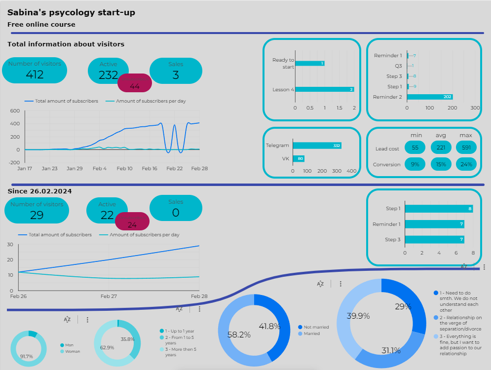

# Portfolio

  <h1> Let me show you something...</h1>

Here you can find my study projects:
  + [Python](https://github.com/ShkliaevPavel/Portfolio/tree/Python)
  + [SQL](https://github.com/ShkliaevPavel/Portfolio/tree/SQL)

When I worked as a clinical research associate I was never satisfied how project information being stored. 
To make it more transparent for all placeholders I started creating PowerBI reports. 
I gathered main information about projects and it looks much better and user-friendly. 
I'm still working on it... 

Some examples:
1. What's the name of that project where...There is so much colleagues...
   + You don't have to remember all 
   + Key information and stakeholders in one place

https://github.com/ShkliaevPavel/Portfolio/assets/169291406/f468a2a2-538c-426d-9fa3-77b21c90ac43

2. Enrollment status: a very significant information for a project team!
    + Now you can see detailed info: Screened / Enrolled / Target etc
    + For each country / region and global status
    + Quick analysis to be sure your project is in timelines (or not...)
    
  https://github.com/ShkliaevPavel/Portfolio/assets/169291406/c05b89fc-414a-4f20-995b-3522fd963ea6

3. Go deeper and find out where you have better results and where some issues need to be fixed
   + You always have plan vs fact
   + Trendline shows where you will be

https://github.com/ShkliaevPavel/Portfolio/assets/169291406/f5615f79-6270-46f8-ba29-46cabfafa41a

4. Quick site status for each visit type

https://github.com/ShkliaevPavel/Portfolio/assets/169291406/1e91ec06-b17a-4ddb-95b6-2b22a5e9a37e

5. What to expect?
+ Choose a project to know when it will finally end

https://github.com/ShkliaevPavel/Portfolio/assets/169291406/bd08cd55-e64a-446c-ae4a-2e342efb870b

Couple months ago my ex-colleague asked me to help with her psycology start-up. 
So i did a [mini-report in Looker](https://lookerstudio.google.com/reporting/0db3861e-57cb-40e5-af72-078a71b49b91) 

 

